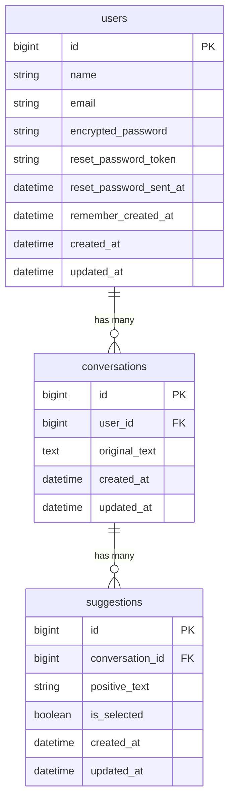

  

<h1 align="center">PosiRem!</h1>

  保育者向け AI 言い換えアプリ 
  ネガティブ・禁止的な表現を、子どもに伝わるポジティブな表現に変換します

  <a href="https://posirem.onrender.com/">https://posirem.onrender.com/</a>

## サービス概要

保育の現場では「走らないで！」「触っちゃダメ！」など、つい禁止語やネガティブな表現を使ってしまうことがあります。しかし、子どもには**肯定的な言葉**のほうが伝わりやすいと言われています。

**PosiRem!** は、保育者が入力したネガティブ・禁止的な表現を AI（OpenAI GPT-4o-mini）が分析し、子どもに伝わるポジティブな表現に変換するアプリです。

### 主な機能

- **AI によるポジティブ変換** — 1つの入力に対して5つの言い換え候補を生成
- **リアルタイムレスポンス** — Turbo Stream による非同期配信で、待ち時間なくスムーズに結果を表示
- **変換履歴の保存・閲覧** — 過去の変換結果をチャット形式で振り返り、無限スクロールで快適に閲覧

## 画面イメージ

  

## 技術スタック

| カテゴリ | 技術 |
|---|---|
| バックエンド | Ruby 3.3.6 / Rails 7.2.3 |
| フロントエンド | Hotwire（Turbo + Stimulus）/ Tailwind CSS + DaisyUI |
| データベース | PostgreSQL |
| AI | OpenAI API（GPT-4o-mini） |
| 認証 | Devise |
| リアルタイム通信 | Action Cable（Solid Cable） |
| インフラ | Render.com |
| CI/CD | GitHub Actions（Brakeman / RuboCop / Minitest） |

## ER 図

## 技術的なポイント

### 非同期 AI レスポンス

OpenAI API の呼び出しを Active Job（`AiSuggestionJob`）でバックグラウンド処理し、結果を Turbo Stream でリアルタイム配信しています。ユーザーはリクエスト送信後、ページ遷移なしで AI の回答を受け取れます。

### チャット風 UI

ユーザーの入力（左）と AI の回答（右）を会話形式で表示するチャット風のインターフェースを Turbo Frame / Turbo Stream で実現しています。

### 無限スクロール

Stimulus コントローラー（`InfiniteScrollController`）を使い、変換履歴を遅延読み込みで表示しています。初回表示を高速化しつつ、過去の履歴もスムーズに閲覧できます。

### CI/CD パイプライン

GitHub Actions で以下を自動実行し、コード品質を担保しています。

1. **Brakeman** — セキュリティ脆弱性スキャン
2. **RuboCop** — コードスタイルチェック
3. **Minitest** — ユニットテスト・システムテスト

